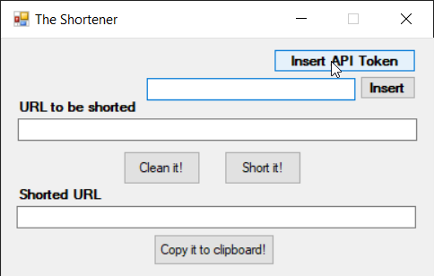
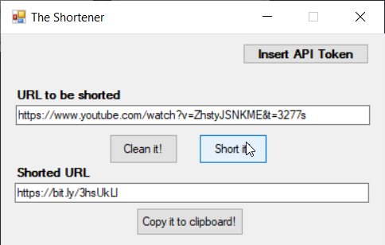
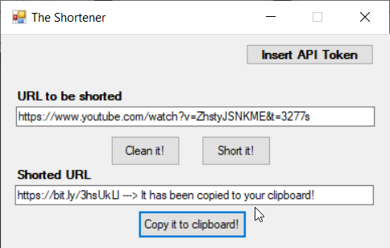

# TheShortener
It's a tool to create a short URL from a long one using <a href="https://dev.bitly.com/get_started.html">Bitly</a> API.

It was built using Windows Forms consuming a <a href="https://dev.bitly.com/get_started.html">Bitly</a> URL shortener API.

## How can I run it?
You can clone or download the code and run it using Visual Studio. Or just download the setup file
<a href="https://github.com/ricardovws/TheShortener/raw/master/TheShortenerExe.zip" download>here</a>.

If you don't have a Bitly account, please, you should do it to keep this application running properly.

You can do it <a href="https://bitly.com/a/sign_in">here</a>. After this, in your Bitly profile go to "Profile Settings", and then go to 
"Generic Access Token", insert your password and generate your API Token.

## How can I use it?
1) Click on "Insert API Token" and then do it :)

2) Paste the long URL that you would like to shorten and click on "Short it!". 

You can clean the text box clicking on "Clean it" and insert another URL there as well.

3) Now it's easy, just click on "Copy it to clipboard" and that's it.

4) Paste your URL shortened anywhere.
