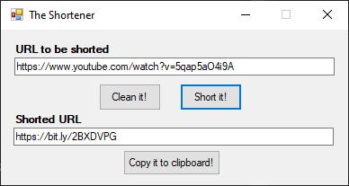
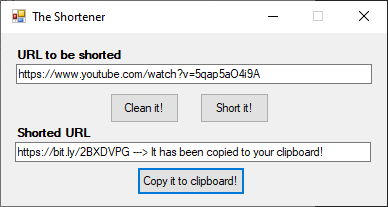

# TheShortener
It's a tool to create a short URL from a long one using Bitly API.
It was built using Windows Forms consuming a Bitly URL shortener API.

## How can I run it?
You can clone or download the code and run it using Visual Studio. Or just download the executable 
<a href="https://github.com/ricardovws/ColorChanger/raw/master/ColorChanger_exe.rar" download>here</a>.

## How can I use it?
1) Paste the long URL that you would like to shorten and click on "Short it!". 

You can clean the text box clicking on "Clean it" and insert another like there as well.

2) Now it's easy, just click on "Copy it to clipboard" and that's it.

3) Paste your URL shortened anywhere.
